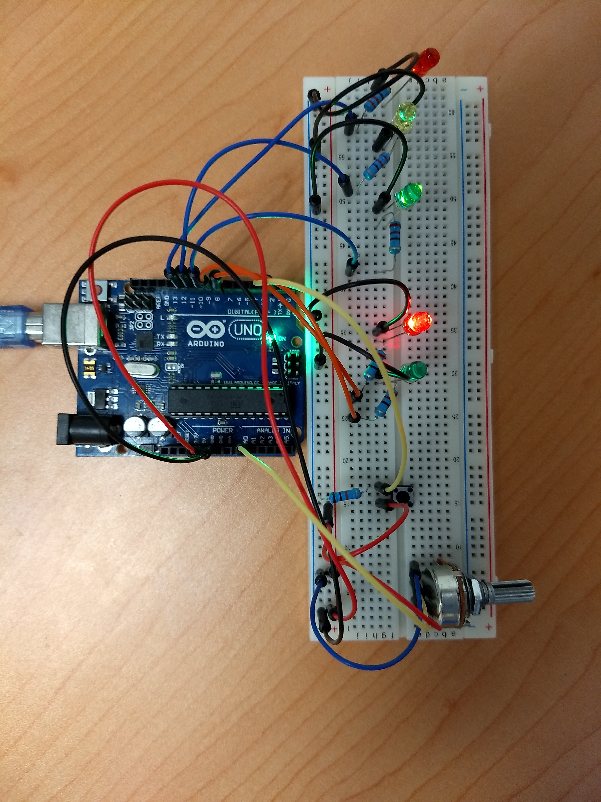

# SemaforoInteractivo
Semaforo interactivo usando Arduino
Este ejemplo muestra un conjunto de semáforos que cambiarán de verde a rojo, ámbar y viceversa, 
luego de un período de tiempo establecido, utilizando el sistema de cuatro estados de Mexico.
Este se extiende para incluir un conjunto de luces peatonales y un botón peatonal para solicitar 
cruzar la calle. El Semaforo reaccionará cuando se presione el botón cambiando el estado de las 
luces para que los autos se detengan y permitan que el peatón cruce con seguridad.  

